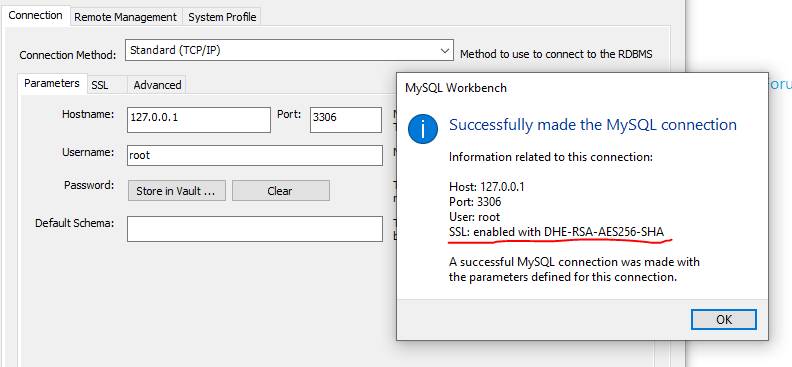

This is only a sample project to startup mysql with ssl enable through the docker compose.
Since I need a mysql:5.7.40 version of mysql, so that version is quite old. Please modify the docker-compose.yml for the latest version of mysql(Not tested, but susppose works well too).

Main step from this [website](https://docs.cpanel.net/knowledge-base/security/how-to-configure-mysql-ssl-connections/).

# Installation
1. Clone the project to local
    ```shell
    git clone https://github.com/xh-dev/docker-mysql-ssl-setup
    cd docker-mysql-ssl-setup # project root
    chmod +x *.sh
    ```
2. Execute the script
    ```shell
    ./run.sh {domain name}
    ```
6. Check if success connect the database with mysql workbench or amdin web portal

will add phpmyadmin screen later on.

# Helps commands

Show version of mysql
```sql
SHOW VARIABLES LIKE 'version';
```

```sql
SELECT * FROM performance_schema.session_status 
WHERE VARIABLE_NAME IN ('Ssl_version','Ssl_cipher');
```
