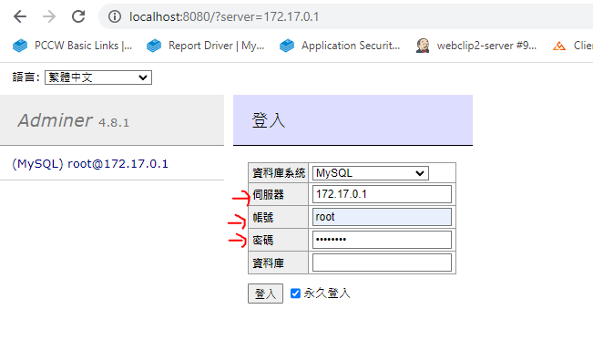

This is only a sample project to startup mysql with ssl enable through the docker compose.
Since I need a mysql:5.7.40 version of mysql, so that version is quite old. Please modify the docker-compose.yml for the latest version of mysql(Not tested, but susppose works well too).

Main step from this [website](https://docs.cpanel.net/knowledge-base/security/how-to-configure-mysql-ssl-connections/).

# Installation
1. Clone the project to local
    ```shell
    git clone https://github.com/xh-dev/docker-mysql-ssl-setup
    cd docker-mysql-ssl-setup # project root
    ```
2. Generate script for creating certificates
    ```shell
    # go project 
    # replace ???? with the domain of you target db and generation run.sh scripts
    sed 's/{base_domain}/????/g' ssl/run.sh_template > ssl/run.sh
    chmod +x ssl/run.sh
    ```
3. Execute script for creating the certificates
    ```shell
    cd ssl
    ./run.sh  # 8 certificates related script is generated
    ```
4. Fix the permission issue (**Optional**)
    ```shell
    # Incase see below warning in the log file
    # 
    # Warning: World-writable config file '/etc/my.cnf' is ignored
    #

    chmod 0444 my.cnf # restrict the permission setting
    ```
5. Execute the docker compose files
    ```shell
    cd .. # go to project root
    docker compose up 
    ```
6. Check if success connect the database with mysql workbench or amdin web portal



# Helps commands

Show version of mysql
```sql
SHOW VARIABLES LIKE 'version';
```

```sql
SELECT * FROM performance_schema.session_status 
WHERE VARIABLE_NAME IN ('Ssl_version','Ssl_cipher');
```